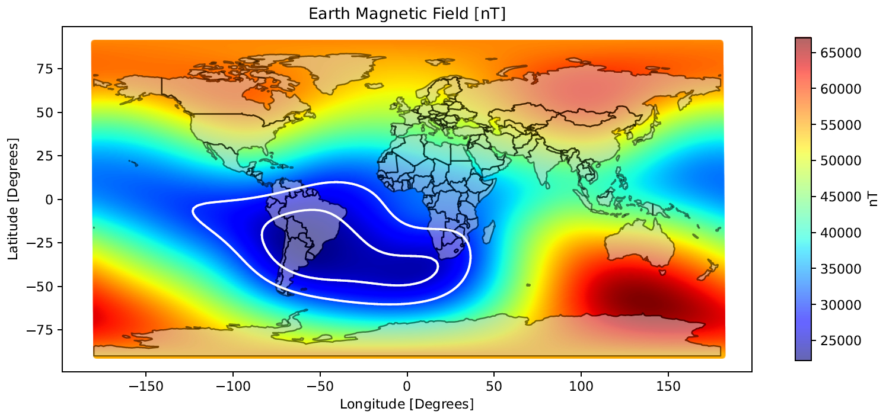
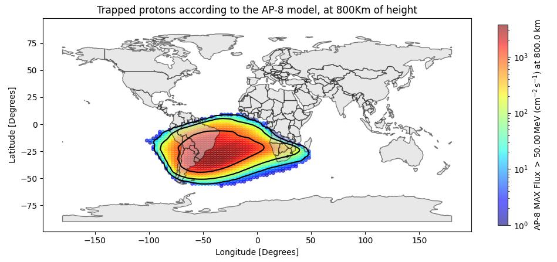

## Rad Orbits

### Abstract

This study presents a novel approach to designing satellite constellations optimized for maximum passage through high-radiation zones, 
offering essential insights into radiation effects on embedded systems. The methodology focuses on evaluating impacts on missions 
equipped with inter-satellite links (ISLs) and tailoring orbital paths to study radiation resilience and system performance in such environments. 
The proposed adaptive design employs polygon-based algorithms [1], leveraging a gradient descent approach [2] to achieve optimal constellation 
configurations. The methodology allows customization based on radiation zone characteristics, which vary by altitude, type of radiation particle, 
and temporal changes in radiation intensity. The flexibility of the approach accepts any dataset for radiation area modeling, 
offering an adaptable tool for the study of radiation impacts. Two use cases are presented: a single-satellite mission 
and a dual-satellite mission to evaluate ISL radiation effects. Simulation results demonstrate the effectiveness of the 
proposed approach in covering radiation-prone regions with different densities, offering valuable data for radiation studies in space environments.

### Relevant papers and info

* https://ieeexplore.ieee.org/document/8714006
* Finlay, C.C., Kloss, C., Olsen, N. et al. The CHAOS-7 geomagnetic field model and observed changes in the South Atlantic Anomaly. Earth Planets Space 72, 156 (2020). https://doi.org/10.1186/s40623-020-01252-9
* https://www.researchgate.net/publication/234501202_KML_generator_to_visualize_geomagnetic_field_models_on_Google_Earth
* https://www.sciencedirect.com/science/article/pii/S1364682617303887
* IGRF: https://es.wikipedia.org/wiki/Campo_de_referencia_geomagnético_internacional
* https://agupubs.onlinelibrary.wiley.com/doi/full/10.1029/2022JA031202
* Proba V EPT: https://register-as.oma.be/esww16/contributions/public/S11-P1/S11-P1-05-BorisovStanislav/ESWW2019_EPTprod_v1.pdf
* Proba V EPT: https://agupubs.onlinelibrary.wiley.com/doi/full/10.1029/2022JA031202
* https://www.aeronomie.be/en/annual-report/radiation-belts-observed-proba-vept

### Datasets

* https://www.ncei.noaa.gov/products/earth-magnetic-model-anomaly-grid-2
* https://www.mathworks.com/matlabcentral/fileexchange/120308-geomagnetic-field-intensity-data
* https://geomag.bgs.ac.uk/education/earthmag.html
* (IGRF) https://www.ngdc.noaa.gov/geomag/magfield-wist/
* (IGRF) https://www.ncei.noaa.gov/products/international-geomagnetic-reference-field
* Solar wind (JSON): https://services.swpc.noaa.gov/products/solar-wind/
* Satellite anomalies: https://www.ngdc.noaa.gov/stp/satellite/anomaly/satelliteanomaly.html
* ESA's space weather: https://swe.ssa.esa.int/current-space-weather#
* Spenvis: https://www.spenvis.oma.be

### Workflow

1. Translate Earth's magnetic field datasets (usually grid-based data, e.g. latitude, longitude, value) into contour polygons at certain thresholds, achieved by magfield2polygons.py. Output looks like the following Figure (obtained using plot_mag_field.py). The Figure depicts two polygons at 25uT and 30uT, envolving what is known as the South Atlantic Anomaly. <br><br>

[update] We can also transpate trapped particle models (Spenvis), for which data is adapted using tpo2polygons.py, and plotted with plot_tpo.py: <br><br>


2. [WIP] Define Orbits' solution space and scenario parameters: time-span, propagators, atmosphere models, Earth's shape model.

3. [WIP] Iterate over Orbits' solution space and simulate satellite-polygon interaction, obtaining access metrics: total access time, access frequency, etc.

#### Python Dependencies
```
pandas, geopandas, matplotlib, shapely, descartes, seaborn, geojson, scipy
```

#### Java Dependencies
```
satellite-tools, constellation-toolkit, orekit
```